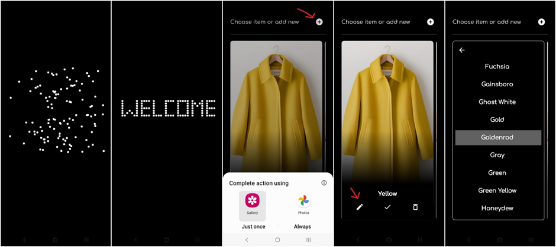

# Clothes Matcher – Frontend

Clothes Matcher is an application designed to help color-blind individuals match their clothing items based on color.

A cross-platform Python application built with [Flet](https://flet.dev/).
This frontend provides an intuitive, mobile-first interface for uploading clothing images and visualizing matching
suggestions retrieved from the backend API.
Visit [this page](https://github.com/wielkate/ClothesMatchingApi) to learn more about backend part.

## Features

- **Accessible Design** – welcome animation, clean UI, large touch targets, high contrast.
- **Real-time Suggestions** – display matched clothing items based on color analysis.
- **Cross-platform** – works on desktop, mobile, and web (via Flet).
- **Integration with Backend API** – connects to FastAPI service with Supabase storage and database.
- **Remove background:** Uses [Rembg](https://www.rembg.com/en) API do remove background before primary color
  determination

## Navigation

This repository has two branches:

- **master** - has both frontend and backend in one code base
- **apk** - delegates backend to several APIs, prepare for publishing on Android

## UI Screens




## Tech Stack

- **Language:** Python 3.12+
- **Framework:** Flet
- **Communication:** REST API calls to backend and Rembg API

## Installation

1. Clone this repository:
   ```bash
   git clone https://github.com/wielkate/ClothesMatching.git
   cd ClothesMatching

2. Install all the necessary dependencies
    ```bash
    pip install 

3. Run the application
    ```bash
   cd src/package_wielkate/main/
   flet run main.py --android  
    ```
4. To publish the Flet app to the certain platform follow [official documentation](https://flet.dev/docs/publish)

## Folder Structure

```yaml
src/package_wielkate/main/
├── assets/          # Icons and fonts
├── endpoints/       # API communication logic
├── models/          # Data models
├── resources/       # Authentication and shared resources
└── ui/              # UI components (App, display cards, file uploader)
tests/
```

## Usage

1. Launch the app.
2. Upload an image of a clothing item.
3. Receive suggested matches based on color compatibility.

## License

This project is licensed under the MIT License.

> AI Disclaimer: the icon.png generated by Microsoft Copilot, clothing items shown on screen were generated by Canva AI